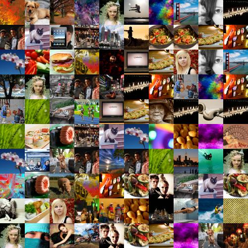

# TODO

* get random internet images
* better examples

# Build a photo mosiac program

* Show some examples
* Start with a discussion about what is happening
* Get students to split into groups and have them define what the challenges are

A good way of solving a problem is to break it into smaller chunks and solve those smaller problems first.

We know we'll need to:

* break an image up into smaller chunks
* calculate the average colour of images
* put images together to build bigger images

So here are some ideas for intermediary, smaller problems.

## Make a pixeliser

Follow the same discussion process as above, your students should arrive at something similar to the following process:

* take an image
* chop it up into smaller chunks
* for each of the chunks get the average colour
* create a rectangle of that colour
* replace the original chunk with the new rectangle
* save as a new file

## Make a montager

Follow the same discussion process as above, your students should arrive at something similar to the following process:

* take a bunch of images
* crop them to be the right size
* stitch them all together and save as a new file

## Combine them both to make the mosiac maker

So now we're at the stage where we've solved the problems we face to build the mosiac maker. We can use the programs, or parts of the programs to build a new program that creates the mosiac.

### Testing

I wrote a little program called [image_creator.py](image_creator.py) that creates uniform little squares of varying colours. This way I can test my mosiac maker works but giving it every colour it needs.

### Improve

* My program runs slowly on real image data, because the images are large and take a while to create the average value. An improvement would be to store analysed image data in a file, and then just read that file instead of having to regenerate it every time I run the mosiac program.
* The fetch_random.py program takes a long time to get random photos. Make it multi threaded for parallel fetching.
